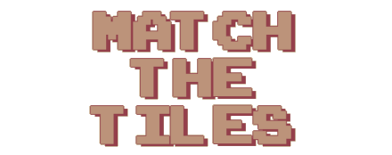
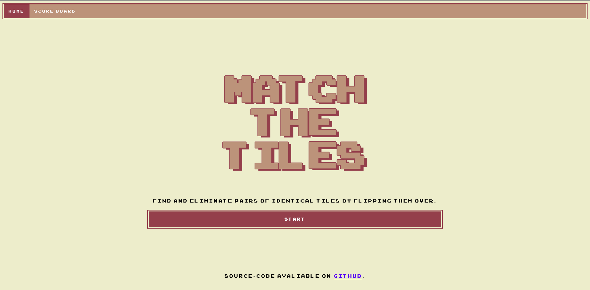
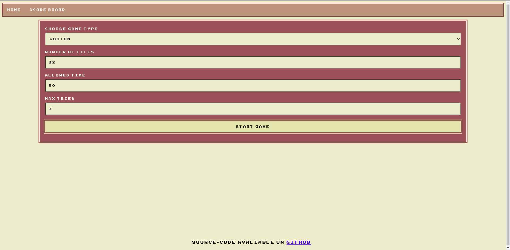
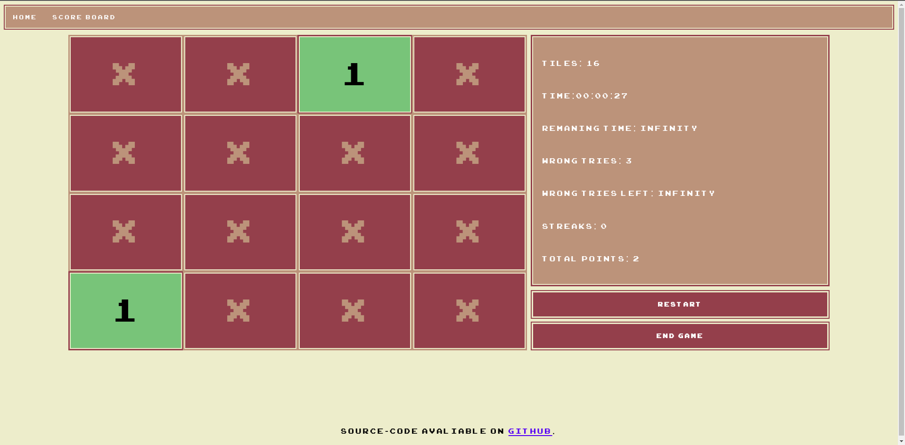
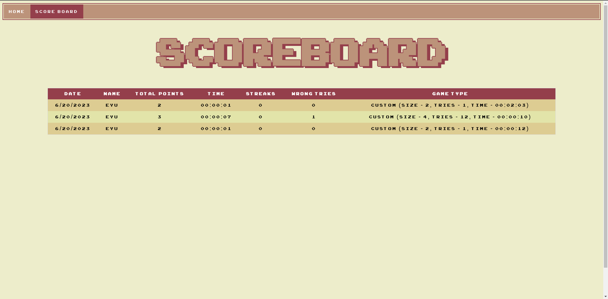

<p align="center">
  <a href="https://github.com/eyuelberga/MatchTheTilesGame">
    
  </a>
</p>

Match the Tiles is a puzzle game where you must find and eliminate pairs of identical tiles by flipping them over, aiming to clear the entire board. [Demo](https://eyuelberga.github.io/MatchTheTilesGame/)

## Preview 





## Development

```bash

$ yarn dev
```

## License

MIT © [Eyuel Berga Woldemichael](https://github.com/eyuelberga)
